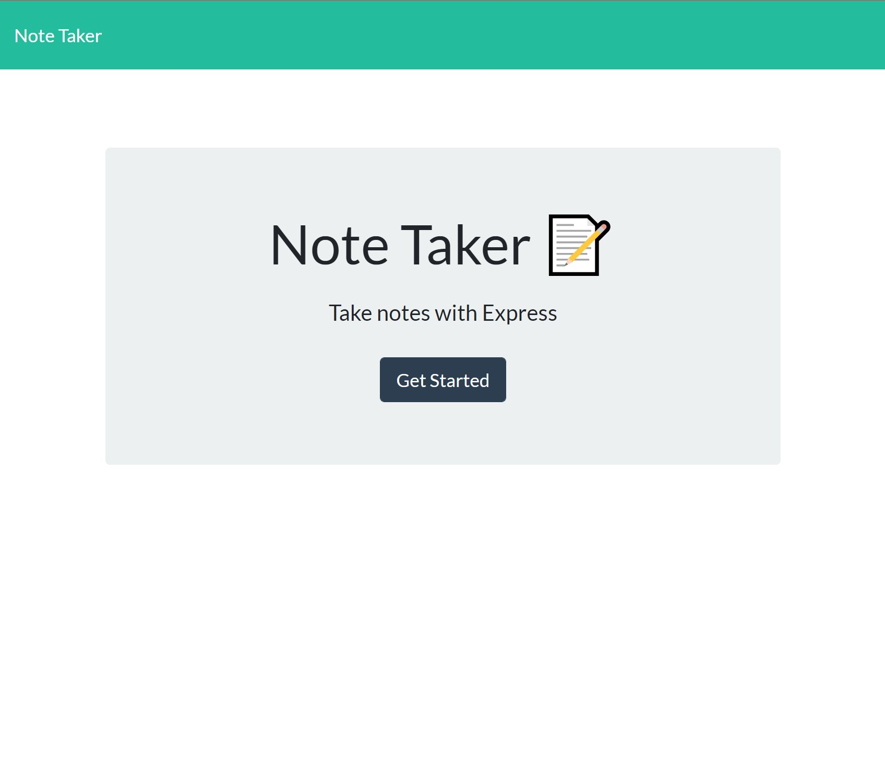
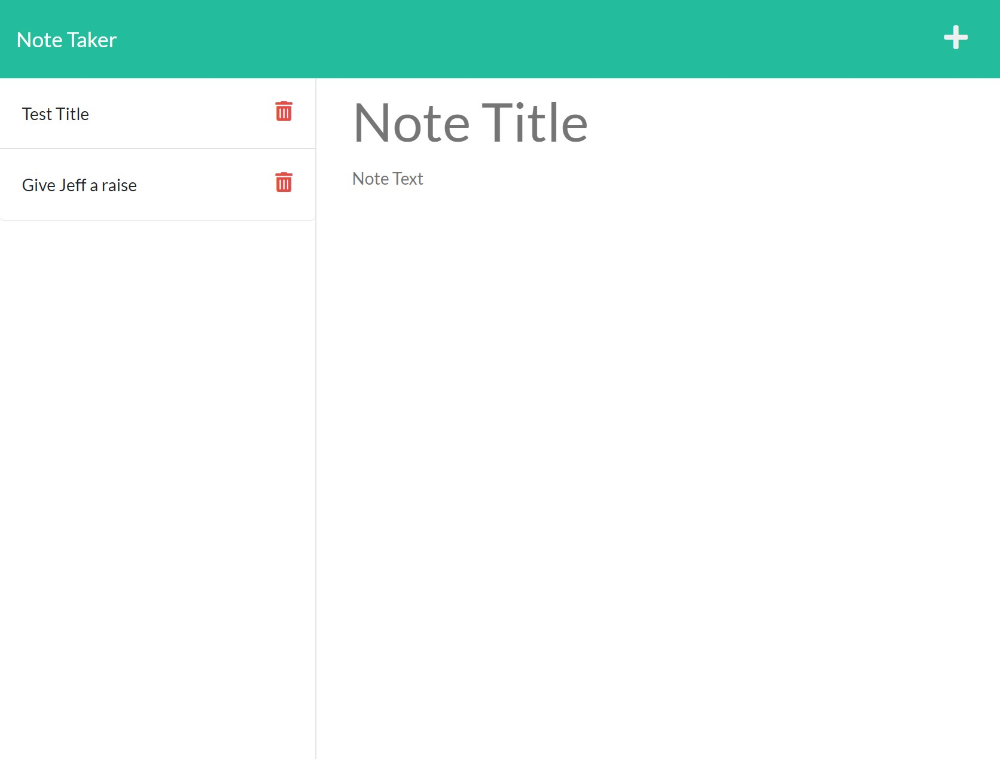

# Duly Noted
[Link to application hosted on Heroku](https://pure-scrubland-31598.herokuapp.com/)

I was given some front end code for a note taking app and was tasked with completing the back end.

---
## Process
I was able to use the index.js file supplied to me in the public folder in order to work out the routes that were necessary for the program. The first routes were easy, simple get and posts. But as I attempted to write the delete route without actually being taught it in class, I realize I would have to do a bit of internet research. After a couple hours I got it working perfectly and I'm very happy with it. Then added the final touches, detailed comments in my code, detailed readme, and hosted on heroku.

---
## Requirements
1. User is presented with note taking app with intuitive functionality
2. Clicking the Save icon will add the note the application's database ad it will appear on the left side of the screen
3. Clicking on one of the notes from the list on the left will load it to the right side of the screen
4. The functionality of the Trash Can icon works appropriately and will also delete the note from the database
5. And lastly, the application is hosted on a Heroku website
---
The following images show the web application's appearance and functionality:

## Cited:
http://expressjs.com/ - for Express.js docuemntation
https://devcenter.heroku.com/ - for Heroku documentation
https://insomnia.rest/ - for route testing
https://www.w3schools.com/ - for some hard to find answers
https://stackoverflow.com/ - for some hard to find answers